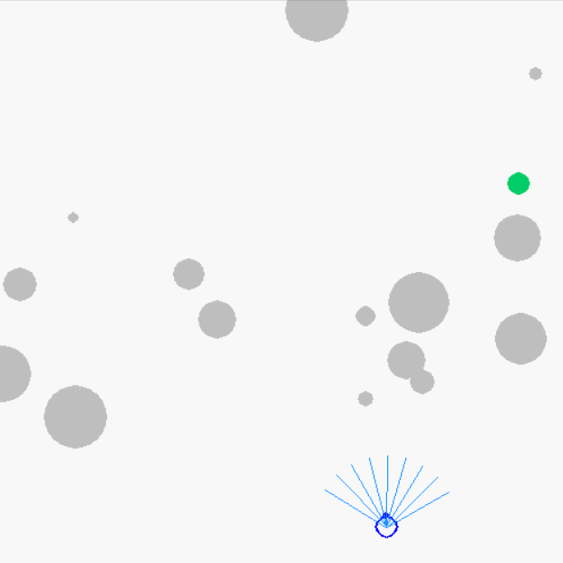
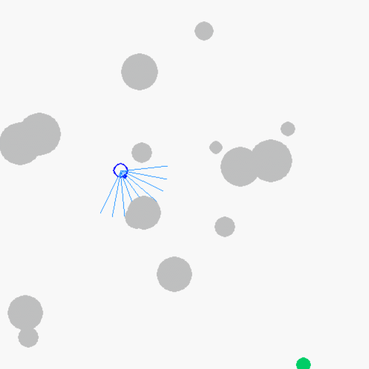

# swarm-control-inspired-by-human
 

# OverView
Navigation and obstacle avoidance for an agent in unknown environments.

# RL
- [Input]: global coordinates of target and robot, velocity of robot, virtual radar information(distance information, in the heading direction of robot with fixed angle)

- [Output]: force in eight direction

- [Reward]: 1. distance with target; 2. radar information compared with threshold distance with obstacles

# Installation Dependencies
* Python3
* pygame
* keras
